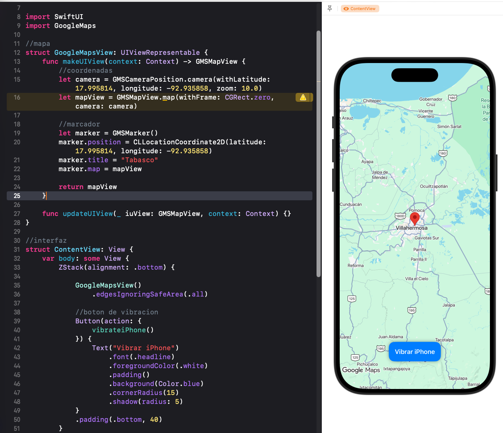

# 🗺️ [AppMapaGer]
App para iPhone/iOS creada en lenguaje swift y SwiftUI, para mostrar un mapa y determinar la ubicacion del usuario en su telefono, tambien se agrego un boton para ejecutar una vibracion breve en el equipo. 

*Utilice Xcode 26 para desarrollarla, tambien Git y Github para el versionado del codigo.

## 📱 Vista Previa


## ✨ Características Principales

Visualización de Mapas: Integración fluida con la interfaz de mapas del sistema.

Marcadores

Geolocalización en tiempo real

Diseño e Interfaz: Desarrollado con una interfaz moderna y adaptativa.

## 🛠️ Tecnologías y Herramientas Utilizadas

Lenguaje: Swift

Frameworks principales:

**SwiftUI para la interfaz de usuario.**

**MapKit para la gestión y renderizado del mapa.**

**CoreLocation.**

```
Entorno de desarrollo: Xcode 26 / macOS 26.

Control de versiones: Git y GitHub.
```

